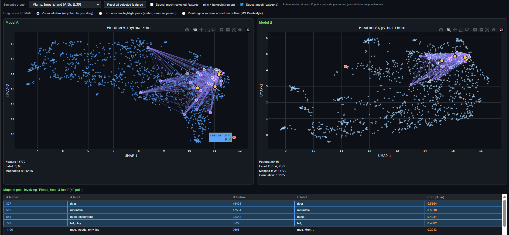

# Quantifying Feature Space Universality Across Large Language Models via Sparse Autoencoders

## Overview

This repository provides the code and resources for our research paper, **Quantifying Feature Space Universality Across Large Language Models via Sparse Autoencoders** ([arXiv:2410.06981](https://arxiv.org/abs/2410.06981)). We study whether **sparse autoencoder (SAE)** feature spaces across different LLMs are geometrically similar even when individual features do not line up one-to-one. We pair features via **activation correlation** (with optional **Hungarian** or **entropic OT** alignment in the UI tool), then measure **relational similarity** of decoder weight geometry (e.g. SVCCA, RSA), including how similarity varies across semantic subspaces.

- **Feature matching across models**: Align and compare SAE features across LLMs using activation correlations.
- **Similarity analysis**: Representational similarity on paired feature weights (SVCCA, RSA, baselines).
- **Visualization**: Figures, notebooks, and an **interactive linked UMAP HTML** for exploring two SAEs side by side (see below).

## Interactive feature-space map (UI)

The script `run_pipeline/pythia_feature_mapping_viz.py` builds a **single self-contained HTML page** (Plotly) with **two linked UMAP panels**—one per model/SAE. The same text batch is run through both base models; features are aligned across models with a full activation correlation matrix (**greedy**, **Hungarian**, or **Sinkhorn OT**); the page reports **CKA**, **RSA**, and **orthogonal Procrustes** statistics on matched activations; selected decoder directions are embedded with UMAP; hover and selection tools highlight **corresponding features** across panels.

**Typical workflow**

1. **Install** dependencies and SAE libraries (see [Getting Started](#getting-started)).
2. From the **repo root**, run: `mkdir -p outputs && python run_pipeline/pythia_feature_mapping_viz.py`  
   Defaults use Pythia 70M vs 160M with matching Eleuther SAEs and TinyStories snippets.
3. Open **`outputs/pythia_sae_feature_map.html`** in a browser (Plotly loads from a CDN).
4. **Hover** points to see feature id, top-token hints, and cross-model correlation where available; use the toolbar to **zoom**, **box-select**, or **paint** a region to build a set of linked pairs and optional mesh overlays.

Full flags, JSON re-render (`--from-json`), semantic category JSON, and troubleshooting: [`run_pipeline/README_pythia_feature_mapping_viz.md`](run_pipeline/README_pythia_feature_mapping_viz.md).

<p align="center">
  
</p>

Quick variant with fewer points:

`python run_pipeline/pythia_feature_mapping_viz.py --features-per-side 800 --dataset-split "train[:256]" --output-html outputs/pythia_sae_feature_map.html`

## Repository Structure

- `run_pipeline/`: Main experiment scripts and **`pythia_feature_mapping_viz.py`** (interactive UI generator)
- `main_results_nbs/`: Jupyter notebooks for experiments and analyses
- `modal_scripts/`: Modal cloud run helpers
- `docs/images/`: README media (UI preview image and short preview video)
- `README.md`: Project documentation

## Getting Started

### Prerequisites

- Python 3.8 or higher

### Installation

#### Option A: Miniconda (Windows, recommended)

1. Open a **Command Prompt** with Miniconda on `PATH` (same pattern as the Start Menu shortcut):

   `%windir%\System32\cmd.exe "/K" C:\Users\mikel\miniconda3\Scripts\activate.bat C:\Users\mikel\miniconda3`

   If your install path differs, adjust both paths to your `miniconda3` folder.

2. Go to the repo root and run the helper script. It creates the `feature-space-mapping` environment (Python 3.11) if needed, then installs `requirements.txt`, `sae_lens`, and `sparsify`:

   `setup_conda_env.cmd`

   Alternatively, create the base env yourself and install pip packages manually:

   `conda env create -f environment.yml`

   `conda activate feature-space-mapping`

   `python -m pip install -r requirements.txt`

   `python -m pip install sae_lens git+https://github.com/wlg1/sparsify.git`

3. Each new CMD session: activate Miniconda as in step 1, then:

   `conda activate feature-space-mapping`

The script finishes by installing **CPU PyTorch from the `pytorch` conda channel**, which tends to be more reliable on Windows than the default pip wheel (fewer missing-DLL issues). It also sets `KMP_DUPLICATE_LIB_OK=TRUE` on the env to avoid an OpenMP duplicate-`libiomp5md.dll` error when importing `torch` with MKL-linked packages. If you use a GPU, run the optional CUDA `pip install ... cu124` line from the script footer **after** that, so it replaces the CPU build.

#### Option B: pip only

Clone the repository and install dependencies:

`pip install -r requirements.txt`

Install these SAE libraries:

`pip install sae_lens`

`pip install git+https://github.com/wlg1/sparsify.git`

<!--- 
Removed sae.pre_acts() on March 22nd 2025 update:
`pip install git+https://github.com/EleutherAI/sae.git`
-->

If running Gemma models, login to HF using:

`huggingface-cli login`

Recommended Hardware Requirements: Allocate ~100 GB of disk space when renting an A100 on Vast.ai (To work with large models like gemma-2-9b)

## Usage (paper pipeline)

In `run_pipeline/`, run:

`chmod +x run_pythia.sh`

`./run_pythia.sh --batch_size 300 --max_length 300 --num_rand_runs 1 --oneToOne_bool --model_A_endLayer 6 --model_B_endLayer 12 --layer_step_size 2`

(TBD- update .sh to do this) to eval separate model pairs in one run:

## Citations

If you use this code or our findings in your research, please cite our paper:

```
@misc{lan2025sparseautoencodersrevealuniversal,
      title={Quantifying Feature Space Universality Across Large Language Models via Sparse Autoencoders},
      author={Michael Lan and Philip Torr and Austin Meek and Ashkan Khakzar and David Krueger and Fazl Barez},
      year={2025},
      eprint={2410.06981},
      archivePrefix={arXiv},
      primaryClass={cs.LG},
      url={https://arxiv.org/abs/2410.06981},
}
```

## TO DO

This repo is currently being restructured
